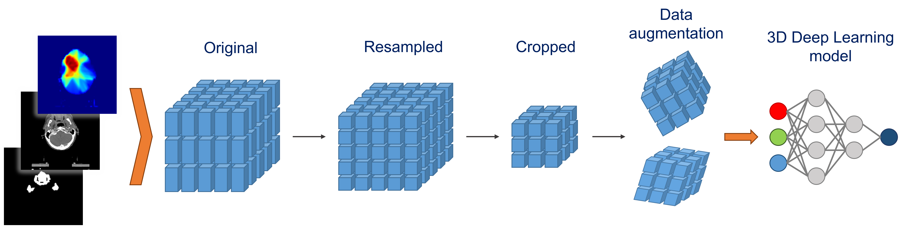
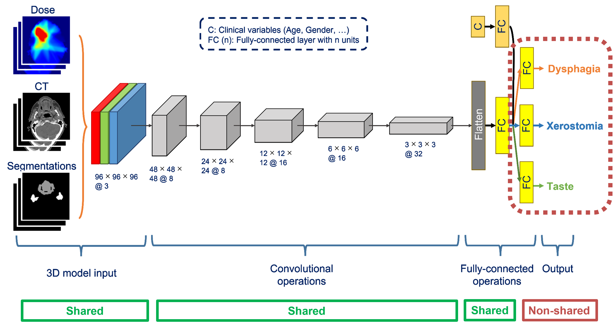

<!---
Markdown syntax: https://www.markdownguide.org/basic-syntax
-->

# Deep Learning-based NTCP multi-toxicity modelling


## Running the data preprocessing pipeline



Details on data preprocessing can be found [here](https://github.com/PRI2MA/DL_NTCP_Xerostomia).


##### Run the code
```
# Change directory to data preprocessing folder
$ cd D:\Github\DL_NTCP_Multitox\data_preproc

# Run main script
$ python main.py
```


## Running the model training and evaluation




##### Requirements
- The `datasets` folder from the data preprocessing pipeline (see the variable `data_preproc_config.data_dir`), 
containing the preprocessed patient folders and the file specified by 
`config.filename_stratified_sampling_test_csv`.


##### Run the code
```
# Change directory to parent folder
$ cd D:\Github\DL_NTCP_Multitox

# Run main script
$ python main.py
```


##### Method
Work in progres...


##### Notes
- Missing endpoint value in the `config.filename_stratified_sampling_test_csv` file (e.g., -1) should be 
different from the values in `config.valid_endpoint_values` (e.g., 0 and 1).
- The columns `config.features_dl` in the `config.filename_stratified_sampling_test_csv` file should 
have no missing values (i.e., completely filled).
